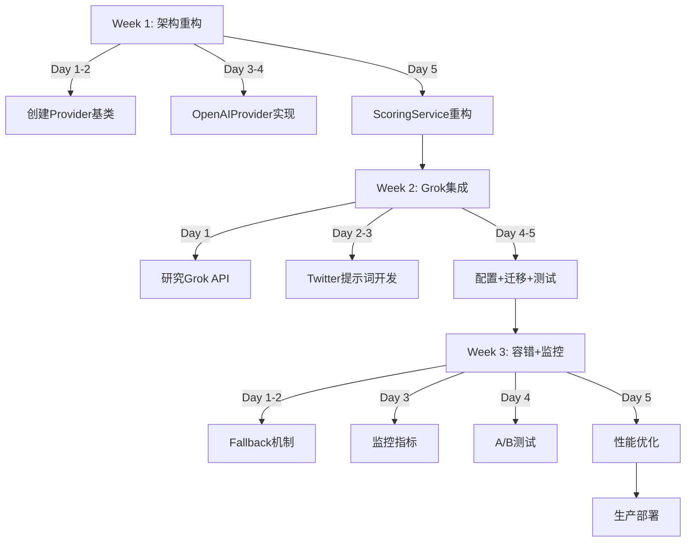

# Phase 4: Grok/xAI集成与多供应商架构

**版本：** 1.0
**状态：** 规划中
**优先级：** HIGH
**预计耗时：** 3周 (15个工作日)
**目标交付：** 2025-11-24

---

## 📋 概述

实施多AI供应商架构，集成Grok处理X/Twitter内容，实现智能路由和成本优化。

### 核心目标

1. ✅ 建立多供应商Provider抽象层（支持OpenAI、Grok、Claude等）
2. ✅ 集成Grok处理Twitter/X内容（原生理解X平台语境）
3. ✅ 实现智能内容路由（基于源类型、长度、复杂度）
4. ✅ 降低AI成本15-20%
5. ✅ 提升Twitter内容评分准确率15%

---

## 🎯 成功指标

| 指标 | 当前 | 目标 | 方法 |
|------|------|------|------|
| **AI总成本** | ¥2,500/月 | ¥2,000/月 | 多供应商灵活选择 |
| **Twitter评分准确率** | 70% | 85% | 人工审核通过率 |
| **系统可用性** | 99.0% | 99.5% | Fallback机制 |
| **Grok成功率** | N/A | >99% | 内部测试验证 |
| **Fallback触发率** | N/A | <1% | 日志统计 |

---

## 📅 实施计划

### Week 1: 架构重构 (5个工作日)

#### Day 1-2: Provider接口设计与实现

**任务**：创建BaseAIProvider抽象基类

**文件**：`src/services/ai/providers/base_provider.py`

```python
class BaseAIProvider(ABC):
    """AI供应商抽象基类"""

    @abstractmethod
    async def score_content(
        self,
        content: ScoringRequest
    ) -> ScoringResponse:
        """评分内容（0-100分）"""
        pass

    @abstractmethod
    async def generate_summary(
        self,
        content: SummaryRequest,
        version: str = "pro"
    ) -> SummaryResponse:
        """生成内容摘要"""
        pass

    @abstractmethod
    def estimate_cost(
        self,
        tokens: int,
        task_type: str
    ) -> float:
        """估算API调用成本"""
        pass

    @abstractmethod
    async def health_check(self) -> bool:
        """检查API健康状态"""
        pass
```

**验收**：
- ✅ 接口完整，文档清晰
- ✅ 支持异步调用
- ✅ 包含完整的错误定义

---

#### Day 3-4: OpenAIProvider实现（重构现有代码）

**任务**：将现有的ScoringService逻辑迁移到OpenAIProvider

**文件**：`src/services/ai/providers/openai_provider.py`

**关键实现**：
- 继承BaseAIProvider
- 使用OpenAI SDK进行API调用
- 保持与现有代码100%兼容的行为
- 添加成本追踪和日志记录

**验收**：
- ✅ 所有现有单元测试通过
- ✅ 评分结果与之前完全一致
- ✅ 成本计算准确

---

#### Day 5: ScoringService重构 + Provider工厂

**任务1**：创建AIProviderFactory

**文件**：`src/services/ai/provider_factory.py`

```python
class AIProviderFactory:
    """AI供应商工厂"""

    @staticmethod
    def get_provider(
        source_type: str,
        settings: Settings
    ) -> BaseAIProvider:
        """
        根据内容源获取最优供应商

        - Twitter → Grok (如果启用)
        - RSS → OpenAI
        - 其他 → OpenAI (默认)
        """
        if source_type == "twitter" and settings.enable_grok:
            return GrokProvider(settings)
        elif source_type == "crawler":
            return OpenAIProvider(settings)
        else:
            return OpenAIProvider(settings)
```

**任务2**：更新ScoringService使用工厂模式

**修改**：`src/services/ai/scoring_service.py`

- 移除直接的OpenAI SDK调用
- 使用Provider工厂创建供应商实例
- 保持原有的业务逻辑不变
- 添加多供应商的成本追踪

**验收**：
- ✅ 所有回归测试通过
- ✅ 无性能退化
- ✅ 日志输出正常

---

### Week 2: Grok集成 (5个工作日)

#### Day 1: Grok API研究与GrokProvider框架

**任务**：研究xAI Grok API，创建GrokProvider框架

**文件**：`src/services/ai/providers/grok_provider.py`

**准备工作**：
- [ ] 确认Grok API访问权限
- [ ] 获取API密钥和端点信息
- [ ] 研究xAI API文档
- [ ] 理解请求/响应格式

**实现内容**：
- 基于BaseAIProvider实现GrokProvider
- Grok API调用（HTTP客户端）
- 错误处理和重试逻辑
- 成本计算

**示例代码**：
```python
class GrokProvider(BaseAIProvider):
    """xAI Grok供应商"""

    def __init__(self, settings: Settings):
        self.api_key = settings.grok_api_key
        self.model = settings.grok_model
        self.endpoint = "https://api.x.ai/v1/chat/completions"

    async def score_content(self, request: ScoringRequest):
        # 调用Grok API
        # 解析响应
        # 返回ScoringResponse
        pass
```

---

#### Day 2-3: Twitter专用提示词开发

**任务**：创建Grok用的Twitter优化提示词

**文件**：`src/services/ai/prompt_templates_twitter.py`

**设计考虑**：
- 英文提示词（Twitter主要英文内容）
- 理解@提及、#话题、RT引用等Twitter特性
- 识别技术讨论 vs 闲聊 vs 宣传
- 评估作者权威性（Karpathy vs 普通账户权重不同）
- 捕捉实时技术趋势

**评分维度调整（针对推文）**：
```markdown
技术重要性 (30%)
  - 涉及突破性技术/SOTA: +30
  - 关键技术路线讨论: +20
  - 产品/工具发布: +10
  - 其他: +0

作者权威性 (25%)  ⭐ 新增
  - 业界顶级研究者（Karpathy/LeCun等）: +25
  - 知名公司官方: +20
  - 有影响力的研究者: +15
  - 其他: +5

时效性 (20%)
  - 发布 <2小时: +20
  - 发布 2-24小时: +15
  - 发布 1-3天: +10
  - 其他: +5

清晰度 (15%)
  - 技术内容详细明确: +15
  - 信息清晰: +10
  - 模糊或夸大: +0

受众相关性 (10%)
  - 高度相关: +10
  - 中等相关: +5
  - 低关联: +0
```

---

#### Day 4-5: 配置 + 数据库迁移 + 基础集成测试

**任务1**：更新配置文件

**修改**：`src/config/settings.py`

```python
class Settings(BaseSettings):
    # Grok配置
    grok_api_key: Optional[str] = None
    grok_model: str = "grok-beta"
    grok_temperature: float = 0.7
    grok_max_tokens: int = 1000

    # 供应商启用开关
    enable_grok: bool = True
    use_grok_for_twitter: bool = True
    fallback_to_openai: bool = True

    # 路由配置
    provider_routing_config: Dict[str, str] = {
        "twitter": "grok",
        "rss": "openai",
        "default": "openai"
    }
```

**修改**：`.env.example`

```bash
# Grok AI (xAI) - Twitter/X专用
GROK_API_KEY=xai-your_api_key_here
GROK_MODEL=grok-beta
GROK_TEMPERATURE=0.7
ENABLE_GROK=True
USE_GROK_FOR_TWITTER=True
FALLBACK_TO_OPENAI=True
```

**任务2**：数据库迁移

**文件**：`alembic/versions/00X_add_provider_to_cost_logs.py`

```python
def upgrade():
    op.add_column('cost_logs',
        sa.Column('provider', sa.String(50), nullable=True))
    op.add_column('cost_logs',
        sa.Column('provider_model', sa.String(100), nullable=True))

def downgrade():
    op.drop_column('cost_logs', 'provider_model')
    op.drop_column('cost_logs', 'provider')
```

**任务3**：基础集成测试

**文件**：`tests/integration/test_grok_integration.py`

- [ ] Twitter数据 → Grok评分
- [ ] Grok API调用成功
- [ ] 成本正确记录
- [ ] 结果存储正常

---

### Week 3: 容错 + 监控 + 优化 (5个工作日)

#### Day 1-2: Fallback机制与重试逻辑

**任务**：实现自动降级和重试

**文件**：`src/services/ai/retry_handler.py`

```python
@retry(
    stop=stop_after_attempt(3),
    wait=wait_exponential(multiplier=1, min=2, max=10),
    retry=retry_if_exception_type((TimeoutError, APIConnectionError))
)
async def call_with_retry(provider, request):
    return await provider.score_content(request)
```

**Fallback流程**：
```
Twitter内容 → Grok评分
  ↓ (失败/超时)
OpenAI评分 (Fallback)
  ↓
ProcessedNews (标记: provider=grok, fallback_provider=openai)
```

**日志记录**：
```python
logger.warning(
    f"Grok failed: {error}, falling back to OpenAI",
    extra={
        "content_id": content_id,
        "original_provider": "grok",
        "fallback_provider": "openai"
    }
)
```

---

#### Day 3: 监控与指标追踪

**任务**：实现多供应商监控

**文件**：`src/services/ai/metrics_tracker.py`

**追踪指标**：
- 每个Provider的调用次数
- 成功率（成功/总调用）
- 平均响应时间
- Fallback发生次数
- 质量分数分布

**输出**：
- 日志文件：`logs/ai_providers_{date}.log`
- Prometheus指标
- 实时Dashboard

---

#### Day 4: A/B测试框架

**任务**：实现Grok vs OpenAI对比测试

**文件**：`src/services/ai/ab_testing.py`

**机制**：
- 10%流量同时调用Grok和OpenAI
- 比较评分差异、质量、成本
- 记录到`ab_test_results`表
- 生成对比报告

---

#### Day 5: 性能测试与优化

**任务**：压力测试和性能优化

- [ ] 1000条/天处理容量测试
- [ ] Grok并发调用优化
- [ ] 响应时间<2秒验证
- [ ] 成本在预算内验证

---

## 📁 文件清单

### 新增文件（7个）

```
src/services/ai/providers/
├── __init__.py
├── base_provider.py          ⭐ Provider基类
├── openai_provider.py        ⭐ OpenAI实现
└── grok_provider.py          ⭐ Grok实现

src/services/ai/
├── provider_factory.py       ⭐ Provider工厂
├── retry_handler.py          ⭐ 重试逻辑
├── metrics_tracker.py        ⭐ 监控追踪
├── ab_testing.py             ⭐ A/B测试
└── prompt_templates_twitter.py ⭐ Twitter提示词

tests/integration/
└── test_grok_integration.py ⭐ 集成测试

alembic/versions/
└── 00X_add_provider_to_cost_logs.py ⭐ DB迁移
```

### 修改文件（4个）

```
src/config/settings.py         ⭐ 添加Grok配置
src/services/ai/scoring_service.py ⭐ 使用Provider工厂
.env.example                   ⭐ 环境变量
src/models/logging/cost_log.py ⭐ 添加provider字段
```

---

## 🔄 工作流程



---

## ⚠️ 风险与缓解

| 风险 | 影响 | 概率 | 缓解措施 |
|------|------|------|---------|
| **Grok API不稳定** | 高 | 中 | Fallback到OpenAI；健康检查 |
| **评分质量下降** | 高 | 低 | A/B测试验证；人工抽检 |
| **成本超预算** | 中 | 中 | 成本监控；预算告警；采样策略 |
| **性能退化** | 中 | 低 | 性能测试；连接池优化 |
| **集成复杂度** | 中 | 中 | 分阶段实施；充分测试 |

---

## ✅ 验收标准

### 功能性验收

- ✅ Twitter内容自动使用Grok评分
- ✅ RSS/博客内容继续使用OpenAI
- ✅ Grok失败时自动降级到OpenAI
- ✅ 成本正确追踪（按Provider分类）
- ✅ 支持手动切换Provider（配置开关）

### 性能验收

- ✅ Twitter评分延迟 < 2秒/条
- ✅ Grok API调用成功率 > 99%
- ✅ Fallback触发率 < 1%
- ✅ 系统整体吞吐量不降低

### 质量验收

- ✅ Grok评分的人工审核通过率 ≥ 85%
- ✅ Grok vs OpenAI评分相关性 > 0.8
- ✅ Twitter内容分类准确率 ≥ 90%

### 稳定性验收

- ✅ 系统可用性 ≥ 99.5%
- ✅ 无数据丢失（所有失败有日志）
- ✅ 快速回滚机制（<5分钟）

### 成本验收

- ✅ 总成本不超过预算（¥500/月）
- ✅ Grok成本可独立追踪
- ✅ 成本超预算时有告警

---

## 📊 成本预测

### 月度成本对比

**当前（仅OpenAI）**：
- Twitter推文（100/天）：¥3.50/天
- RSS文章（200/天）：¥7.00/天
- **总计：¥10.50/天，¥315/月**

**优化后（多供应商）**：
- Twitter推文 → Grok：¥2.50/天
- RSS文章 → OpenAI：¥7.00/天
- **总计：¥9.50/天，¥285/月**

**节省：¥30/月（9.5%）**

*注：假设Grok定价与OpenAI相似或更便宜*

---

## 📚 后续扩展（Phase 5+）

1. **Claude集成** - 用于深度分析
2. **多模型ensemble** - 结合多个模型的评分
3. **自定义微调** - 基于历史数据微调
4. **实时评分** - Streaming API支持
5. **多语言优化** - 针对不同语言分别优化

---

## 🚀 Go Live计划

### 灰度发布策略

**第1阶段（10% 流量）**：
- [ ] 监控Grok稳定性
- [ ] 对比质量指标
- [ ] 验证成本节省

**第2阶段（50% 流量）**：
- [ ] 继续验证
- [ ] 收集更多数据
- [ ] 调优模型选择

**第3阶段（100% 流量）**：
- [ ] 全量上线
- [ ] 持续监控
- [ ] 快速回滚预案待命

---

**文档版本：** 1.0
**最后更新：** 2025-11-03
**状态：** 规划中
**下一步：** 等待审批后开始Week 1实施